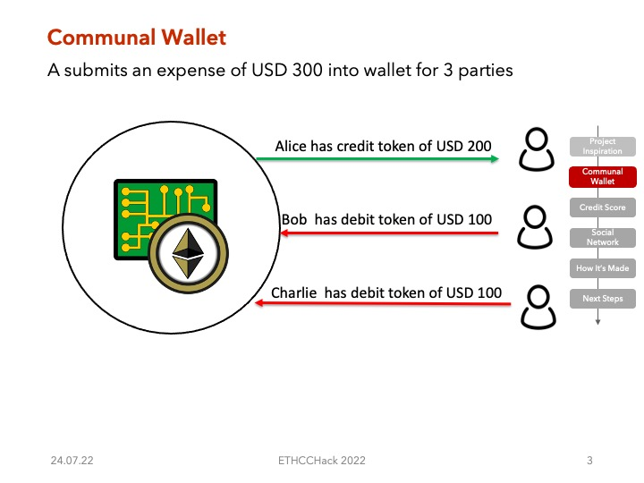

# adamfoɔ protocol

Hackathon project during Eth CC 2022

- [Live Demo](https://www.adamfo.xyz)
- [Dev Post submission](https://devpost.com/software/adamfo-protocol)

## Deployed Networks

| Network      | Subgraph                                                                              | Contract                                                                                                         |
| ------------ | ------------------------------------------------------------------------------------- | ---------------------------------------------------------------------------------------------------------------- |
| Celo         | https://thegraph.com/hosted-service/subgraph/schmidsi/adamfo-celo?selected=playground | https://explorer.celo.org/address/0x327811d200D56cCeb7b3EA241B8434d719bB23aE/transactions                        |
| Gnosis Chain | https://thegraph.com/hosted-service/subgraph/schmidsi/adamfo-gnosis                   | https://blockscout.com/xdai/mainnet/address/0xF28F804060e9D785197CA12C26B46384928fae15/transactions#address-tabs |
| Polygon      | https://thegraph.com/hosted-service/subgraph/schmidsi/adamfo-polygon                  | https://polygonscan.com/address/0xE6EFb17f11d1B1aFFb34bAeb4C228Bd351292c41                                       |

- [Deployed networks](./contracts/networks.json)
